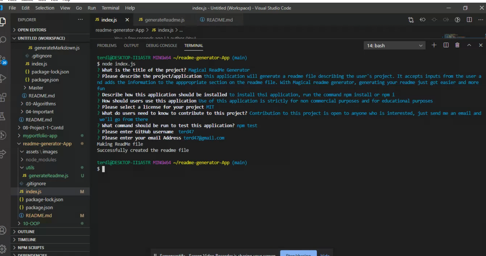

# Magical ReadMe Generator

## Profile and Email

terd47

terd47@gmail.com


## Table of Content
-[Description](#description)

-[Installation](#installation)

-[Usage](#usage)

-[Licenses](#licenses)

-[Contribution](#contribution)

-[Test](#test)

-[Profile](#profile)

-[Questions](#profile)

## Username:
  terd47

## Description:             
  this application will generate a readme file describing the user's project. It accepts inputs from the user and adds the information to the appropriate section on the readme file. With Magical readme generator, generating your readme just got easier and more fun

## Installation:   
The following command should be run to install necessary dependencies  
   ```         
   npm install or npm i
   ```

## Usage:              
  Use of this application is strictly for non commercial and educational purposes 

## Licenses:          
This application is licensed under the  MIT License

* [License](#license)


 
## Contribution:            
  Contribution to this project is open to anyone who is interested, just send me an email and we'll go from there

## Test:      
  To test this application, run the following command
  ```      
  npm test
  ```

## Profile:             
  [terd47](https://github.com/terd47/)

## Questions:
  For any questions or inquiries, you can you can open an issue or reach me directly through at terd47@gmail.com
   to see my other works, checkout my github at [terd47](https://github.com/terd47/).
    
 * Generated by ReadMe Generator
   
[Walk-through video](https://drive.google.com/file/d/1m9jlfsM8NoslO-3X7tIplwSvl1Zpb8mw/view?usp=sharing)

